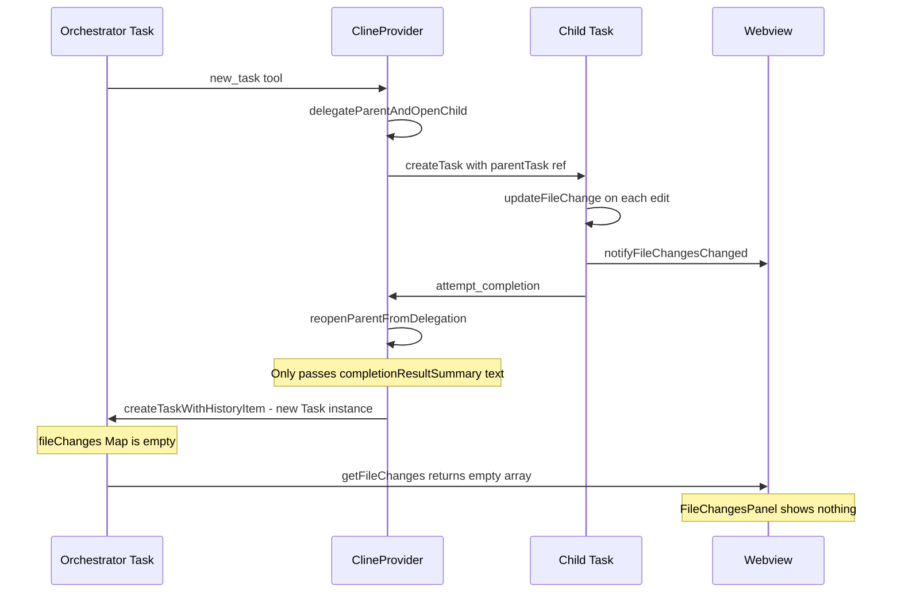
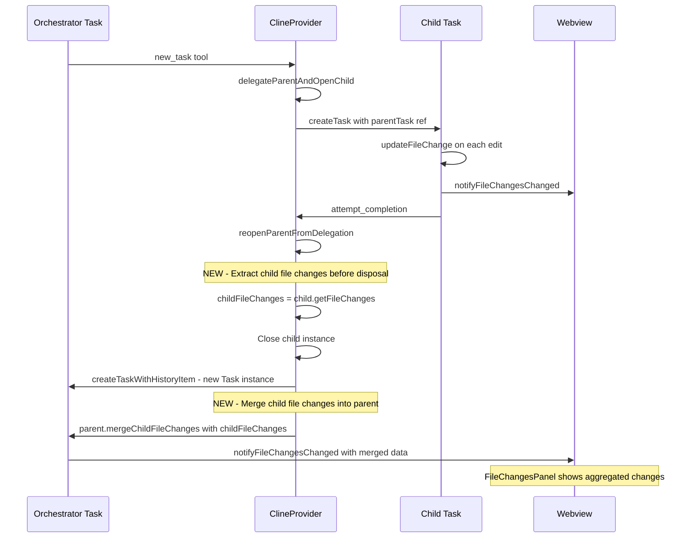
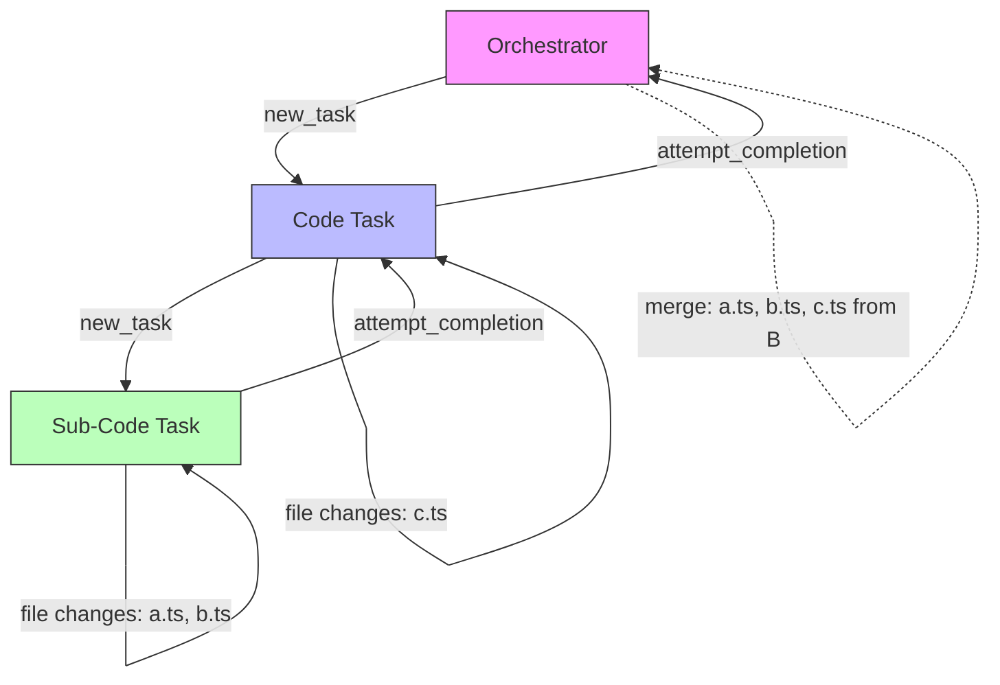

# Design: Orchestrator File Changes Aggregation from Subtasks

## Problem Statement

เมื่อ Orchestrator mode delegate งานไปยัง subtasks ผ่าน `new_task` tool แล้ว subtask แก้ไขไฟล์ — file changes แสดงเฉพาะใน subtask context เท่านั้น Parent orchestrator ไม่แสดง File Changes Panel เพราะ:

1. Orchestrator มี `groups: []` — ไม่มี edit tools จึงไม่มี file changes ของตัวเอง
2. แต่ละ Task มี `fileChanges: Map<string, FileChange>` แยกกัน
3. `reopenParentFromDelegation()` ส่งเฉพาะ `completionResultSummary` (text) กลับ parent — ไม่ส่ง file change data

## Architecture Analysis

### Data Flow (Current)



### Key Components

| Component                                                                 | File     | Role                                                                         |
| ------------------------------------------------------------------------- | -------- | ---------------------------------------------------------------------------- |
| [`Task.updateFileChange()`](src/core/task/Task.ts)                        | Backend  | Tracks file changes per task, deduplicates by path                           |
| [`Task.notifyFileChangesChanged()`](src/core/task/Task.ts)                | Backend  | Posts `fileChanges` message to webview                                       |
| [`Task.getFileChanges()`](src/core/task/Task.ts)                          | Backend  | Returns `Array.from(this.fileChanges.values())`                              |
| [`delegateParentAndOpenChild()`](src/core/webview/ClineProvider.ts:2642)  | Backend  | Creates child task, disposes parent                                          |
| [`reopenParentFromDelegation()`](src/core/webview/ClineProvider.ts:2752)  | Backend  | Reopens parent after child completes                                         |
| [`FileChangesPanel`](webview-ui/src/components/chat/FileChangesPanel.tsx) | Frontend | Renders file changes, uses `backendFileChanges` or message fallback          |
| [`webviewMessageHandler`](src/core/webview/webviewMessageHandler.ts:1197) | Backend  | Handles `getFileChanges` request from webview                                |
| [`FileChange`](packages/types/src/vscode-extension-host.ts:824)           | Types    | Interface: path, originalContent, updatedContent, diff, diffStats, timestamp |

## Solution: Backend In-Memory Propagation

### Approach

เลือก **Approach A: Backend Propagation** เพราะ:

- **Simple**: แก้ 2 ไฟล์หลัก + tests
- **Reliable**: ใช้ existing `updateFileChange()` mechanism ที่ handle dedup อยู่แล้ว
- **Real-time**: propagate ทันทีที่ subtask complete
- **Nested support**: ทำงานกับ nested subtasks โดยธรรมชาติ — แต่ละ level merge ขึ้น parent

### Data Flow (Proposed)



### Nested Subtasks



แต่ละ level propagate file changes ขึ้น parent:

1. Sub-Code completes → file changes `a.ts, b.ts` merge เข้า Code Task
2. Code Task completes → file changes `a.ts, b.ts, c.ts` merge เข้า Orchestrator

## Implementation Plan

### Step 1: Add `mergeChildFileChanges()` to Task

**File**: [`src/core/task/Task.ts`](src/core/task/Task.ts)

**Change**: เพิ่ม method ใหม่ `mergeChildFileChanges(changes: FileChange[])`

```typescript
/**
 * Merge file changes from a completed child subtask into this task.
 * Used by orchestrator/parent tasks to aggregate file changes from delegated work.
 * Leverages existing updateFileChange() for deduplication and originalContent preservation.
 */
mergeChildFileChanges(changes: FileChange[]): void {
    for (const change of changes) {
        this.updateFileChange(change)
    }
}
```

**Why use `updateFileChange()`**:

- Already handles deduplication by path
- Preserves `originalContent` from the first time a file was tracked
- Calls `notifyFileChangesChanged()` on each update which sends data to webview
- Handles `timestamp` preservation

**Optimization**: อาจ batch notify ได้โดย suppress notification ระหว่าง loop แล้ว notify ครั้งเดียวท้าย:

```typescript
mergeChildFileChanges(changes: FileChange[]): void {
    if (changes.length === 0) return

    for (const change of changes) {
        // Directly merge into the map without per-item notification
        const existing = this.fileChanges.get(change.path)
        if (existing) {
            // Preserve original content from the earliest change
            this.fileChanges.set(change.path, {
                ...change,
                originalContent: existing.originalContent ?? change.originalContent,
                timestamp: existing.timestamp ?? change.timestamp,
            })
        } else {
            this.fileChanges.set(change.path, { ...change })
        }
    }

    // Single notification after all merges
    this.notifyFileChangesChanged()
}
```

### Step 2: Extract and Propagate File Changes in `reopenParentFromDelegation()`

**File**: [`src/core/webview/ClineProvider.ts`](src/core/webview/ClineProvider.ts)

**Change**: In `reopenParentFromDelegation()`, extract child file changes before disposal and merge after parent creation.

**Location**: Between existing steps 5 and 6 (line ~2897), and after step 8 (line ~2922)

```typescript
// Add after step 5 (emit TaskDelegationCompleted), before step 6 (close child):

// 5.5) Extract child file changes BEFORE disposing the child instance
const childTask = this.getCurrentTask()
const childFileChanges = childTask?.taskId === childTaskId ? childTask.getFileChanges() : []

// ... existing step 6: close child ...
// ... existing step 7: reopen parent ...
// ... existing step 8: inject histories ...

// Add after step 8 (inject histories), before step 9 (emit resumed):

// 8.5) Merge child file changes into parent task
if (parentInstance && childFileChanges.length > 0) {
	try {
		parentInstance.mergeChildFileChanges(childFileChanges)
	} catch (err) {
		this.log(
			`[reopenParentFromDelegation] Failed to merge child file changes: ${
				(err as Error)?.message ?? String(err)
			}`,
		)
	}
}
```

### Step 3: Tests

#### 3a. Unit Test: `mergeChildFileChanges()`

**File**: [`src/core/task/__tests__/file-changes.spec.ts`](src/core/task/__tests__/file-changes.spec.ts)

**New test cases**:

```typescript
describe("mergeChildFileChanges", () => {
	it("should merge child file changes into parent", () => {
		// Setup parent task
		// Add child changes
		// Verify parent has the merged changes
	})

	it("should preserve originalContent from earliest change", () => {
		// Parent already has change for file.ts with originalContent "v1"
		// Child has change for file.ts with originalContent "v2"
		// After merge, parent should still have originalContent "v1"
	})

	it("should handle empty changes array", () => {
		// No notification should fire
	})

	it("should deduplicate by path", () => {
		// Multiple changes to same file should result in one entry
	})

	it("should notify webview once after merge", () => {
		// Verify notifyFileChangesChanged called once, not per-item
	})

	it("should handle nested subtask aggregation", () => {
		// Simulate: grandchild changes → child merge → parent merge
	})
})
```

#### 3b. Integration Test: Propagation in ClineProvider

**File**: [`src/core/webview/__tests__/ClineProvider.spec.ts`](src/core/webview/__tests__/ClineProvider.spec.ts)

**New test case**:

```typescript
describe("reopenParentFromDelegation - file changes propagation", () => {
	it("should propagate child file changes to parent task", async () => {
		// 1. Create parent task
		// 2. Delegate to child
		// 3. Child makes file changes
		// 4. Complete child via reopenParentFromDelegation
		// 5. Verify parent has the child's file changes
	})
})
```

## Files Changed Summary

| File                                                                                                   | Change Type   | Description                                                    |
| ------------------------------------------------------------------------------------------------------ | ------------- | -------------------------------------------------------------- |
| [`src/core/task/Task.ts`](src/core/task/Task.ts)                                                       | Add method    | `mergeChildFileChanges(changes: FileChange[])`                 |
| [`src/core/webview/ClineProvider.ts`](src/core/webview/ClineProvider.ts)                               | Modify method | Extract + merge file changes in `reopenParentFromDelegation()` |
| [`src/core/task/__tests__/file-changes.spec.ts`](src/core/task/__tests__/file-changes.spec.ts)         | Add tests     | Unit tests for `mergeChildFileChanges()`                       |
| [`src/core/webview/__tests__/ClineProvider.spec.ts`](src/core/webview/__tests__/ClineProvider.spec.ts) | Add tests     | Integration test for propagation                               |

## Edge Cases

| Scenario                                | Behavior                                                                                |
| --------------------------------------- | --------------------------------------------------------------------------------------- |
| Same file modified by multiple subtasks | `updateFileChange` preserves earliest `originalContent`, latest `updatedContent`/`diff` |
| Parent has own file changes             | Merge doesn't overwrite — union of all changes                                          |
| Subtask aborted                         | File changes still propagated since they reflect actual disk state                      |
| Multiple sequential subtasks            | Each subtask's changes accumulate in parent                                             |
| Empty file changes from child           | No-op, no notification                                                                  |
| Nested subtasks 3+ levels deep          | Works naturally — each level propagates up                                              |

## Risk Assessment

| Risk                                  | Severity | Mitigation                                                                                  |
| ------------------------------------- | -------- | ------------------------------------------------------------------------------------------- |
| Memory usage with many file changes   | Low      | `fileChanges` Map is bounded by number of unique files                                      |
| Race condition during delegation      | Low      | Single-open-task invariant enforced — only one task active at a time                        |
| File changes lost on extension reload | Medium   | This is existing behavior for ALL tasks — future enhancement: persist to `fileChanges.json` |
| Notification flooding during merge    | Low      | Batch merge with single `notifyFileChangesChanged()` call                                   |

## Future Enhancements

1. **File Changes Persistence**: Save `fileChanges.json` per task for survival across extension reload
2. **Visual Indication**: Show which file changes came from which subtask
3. **Incremental Updates**: Stream file changes from child to parent in real-time during subtask execution, not just at completion
