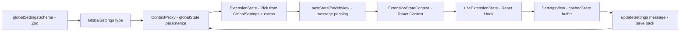

# Font Size Adjustment Feature — Architecture Document

## 1. สรุปโครงสร้าง State Management

โปรเจกต์ใช้ state management pattern ดังนี้:



### รายละเอียดแต่ละ layer:

| Layer                  | ไฟล์                                                                            | หน้าที่                                                          |
| ---------------------- | ------------------------------------------------------------------------------- | ---------------------------------------------------------------- |
| Schema/Type Definition | [`globalSettingsSchema`](packages/types/src/global-settings.ts:57)              | Zod schema กำหนด shape ของ settings ทั้งหมด                      |
| State Type             | [`ExtensionState`](packages/types/src/vscode-extension-host.ts:243)             | `Pick<GlobalSettings, ...>` เลือก fields ที่ส่งไป webview        |
| Persistence            | [`ContextProxy`](src/core/config/ContextProxy.ts)                               | อ่าน/เขียน VSCode `globalState` + `secrets`                      |
| Message Handler        | [`webviewMessageHandler`](src/core/webview/webviewMessageHandler.ts:548)        | จัดการ `updateSettings` message จาก webview                      |
| React Context          | [`ExtensionStateContext`](webview-ui/src/context/ExtensionStateContext.tsx:184) | React Context + Provider ที่ hydrate state จาก extension         |
| Settings UI            | [`SettingsView`](webview-ui/src/components/settings/SettingsView.tsx:123)       | ใช้ `cachedState` buffer pattern - ไม่ bind โดยตรงกับ live state |
| UI Settings Tab        | [`UISettings`](webview-ui/src/components/settings/UISettings.tsx:17)            | Component สำหรับ UI-related settings                             |

### Settings Save Flow:

1. User แก้ไขค่าใน UI → อัพเดท `cachedState` ผ่าน `setCachedStateField()`
2. User กด Save → `handleSubmit()` ส่ง `postMessage({ type: "updateSettings", updatedSettings: {...} })`
3. Extension host รับ message → loop ผ่าน key-value pairs → เรียก `contextProxy.setValue()` สำหรับแต่ละ key
4. Extension host เรียก `postStateToWebview()` → broadcast state กลับไปที่ webview

---

## 2. แนะนำตำแหน่งเก็บ Font Size State

### Option ที่แนะนำ: เพิ่มใน `globalSettingsSchema` เป็น `webviewFontSizeMultiplier`

**เหตุผล:**

- ใช้ pattern เดียวกับ settings อื่นๆ เช่น `ttsSpeed`, `soundVolume`, `screenshotQuality`
- persist ข้าม sessions ผ่าน VSCode `globalState`
- sync ระหว่าง extension host และ webview อัตโนมัติ

**ค่าที่แนะนำ:**

```typescript
// packages/types/src/global-settings.ts
webviewFontSizeMultiplier: z.number().min(0.5).max(2.0).optional()
// default: 1.0 (100% - ไม่เปลี่ยนแปลง)
// range: 0.5 (50%) ถึง 2.0 (200%)
// step: 0.1
```

**ทำไมไม่ใช้ approach อื่น:**

| Approach                  | ข้อเสีย                                                    |
| ------------------------- | ---------------------------------------------------------- |
| VSCode workspace settings | ไม่เหมาะกับ per-user preference ที่ข้าม workspace          |
| CSS-only (ไม่ persist)    | หายเมื่อ reload webview                                    |
| localStorage ใน webview   | ไม่ sync กับ extension host, หายเมื่อ webview ถูก recreate |

---

## 3. UI Placement สำหรับ Font Size Controls

### ตำแหน่งหลัก: Settings > UI Tab

เพิ่มใน [`UISettings.tsx`](webview-ui/src/components/settings/UISettings.tsx) ต่อจาก Enter Key Behavior setting:

```
┌──────────────────────────────────────────┐
│ UI Settings                              │
├──────────────────────────────────────────┤
│ ☑ Collapse Thinking Messages             │
│   Description...                         │
│                                          │
│ ☑ Require Ctrl+Enter to Send             │
│   Description...                         │
│                                          │
│ 🔤 Webview Font Size                     │
│   [A-]  ━━━━━━●━━━━━━━  [A+]   100%     │
│   Adjust the font size of the webview    │
│   content. Default: 100%                 │
│                                          │
│   [Reset to Default]                     │
└──────────────────────────────────────────┘
```

### UI Components ที่ต้องใช้:

- **Slider**: สำหรับเลื่อนค่า 50%–200%
- **+/- Buttons**: ปุ่มเพิ่ม/ลดทีละ 10%
- **Label**: แสดงค่า % ปัจจุบัน
- **Reset Button**: รีเซ็ตกลับ 100%

### ทางเลือกเพิ่มเติม (Optional): Quick Controls ที่ Chat Header

อาจเพิ่มปุ่ม +/- เล็กๆ ที่ header ของ chat view เพื่อให้ปรับได้เร็วโดยไม่ต้องเข้า Settings แต่ควรทำเป็น Phase 2

---

## 4. วิธี Apply Font Size ไปที่ Webview Content

### Approach ที่ใช้จริง: CSS Custom Property `--webview-font-size` + Runtime Binding

> **หมายเหตุ:** Design เดิมเสนอใช้ `--font-size-multiplier` เป็น multiplier คูณ `--vscode-font-size`
> แต่ implementation จริงใช้ `--webview-font-size` เป็นค่า pixel ตรงๆ (เช่น `16px`) แทน
> เพื่อให้ตรงกับ `webviewFontSize` setting ที่เก็บเป็น absolute pixel value (8–28, default 13)

#### 4.1 CSS Variable Declaration (index.css)

ใน [`index.css`](webview-ui/src/index.css:28) Tailwind text tokens คำนวณจาก `--webview-font-size`:

```css
@theme {
	--text-xs: calc(var(--webview-font-size, 13px) * 0.85);
	--text-sm: calc(var(--webview-font-size, 13px) * 0.9);
	--text-base: var(--webview-font-size, 13px);
	--text-lg: calc(var(--webview-font-size, 13px) * 1.1);
}
```

`body` และ `#root` ก็ใช้ `--webview-font-size` เป็น base font-size:

```css
body,
#root {
	font-size: var(--webview-font-size, 13px);
}
```

#### 4.2 Runtime Binding (App.tsx & BrowserSessionPanel.tsx)

CSS variable `--webview-font-size` ต้องถูก set ลง DOM จาก JavaScript เมื่อ state เปลี่ยน
มี 2 จุดที่ทำ runtime binding:

**[`App.tsx`](webview-ui/src/App.tsx:197)** — main webview entry point:

```typescript
useEffect(() => {
	const size = webviewFontSize ?? 13
	document.documentElement.style.setProperty("--webview-font-size", `${size}px`)
}, [webviewFontSize])
```

**[`BrowserSessionPanel.tsx`](webview-ui/src/components/browser-session/BrowserSessionPanel.tsx:24)** — separate browser session panel webview:

```typescript
useEffect(() => {
	const size = webviewFontSize ?? 13
	document.documentElement.style.setProperty("--webview-font-size", `${size}px`)
}, [webviewFontSize])
```

> ⚠️ **สำคัญ:** ถ้าไม่มี useEffect นี้ CSS variable จะไม่มีค่าใน DOM (มีแค่ fallback `13px` ใน CSS)
> ทำให้ user เปลี่ยนค่าแล้วไม่เห็นผล — นี่คือ bug ที่แก้ไขใน runtime binding fix

#### 4.3 Data Flow Diagram

```
User changes font size in UISettings
  → cachedState updated
  → User clicks Save
  → postMessage({ type: "updateSettings", ... })
  → Extension host: contextProxy.setValue("webviewFontSize", value)
  → postStateToWebview() broadcasts new state
  → ExtensionStateContext receives updated webviewFontSize
  → App.tsx useEffect fires
  → document.documentElement.style.setProperty("--webview-font-size", "Xpx")
  → CSS cascades to all Tailwind text tokens and body font-size
```

### ข้อดีของ approach นี้:

1. **ไม่ต้องแก้ component แต่ละตัว** — CSS variable propagate ไปทุก element อัตโนมัติ (ยกเว้นที่ hardcode font-size ด้วย inline style)
2. **Fallback ที่ปลอดภัย** — `var(--webview-font-size, 13px)` ทำให้ไม่มีปัญหาถ้าค่ายังไม่ถูก set
3. **Performance ดี** — เปลี่ยน 1 CSS variable ไม่ต้อง re-render React components
4. **ค่า Absolute pixel** — ง่ายต่อการ debug และเข้าใจ (เช่น `16px` แทนที่จะเป็น multiplier `1.23`)

---

## 5. ไฟล์ที่ต้องแก้ไข

### Backend (Extension Host)

| ไฟล์                                                                                             | การเปลี่ยนแปลง                                                  |
| ------------------------------------------------------------------------------------------------ | --------------------------------------------------------------- |
| [`packages/types/src/global-settings.ts`](packages/types/src/global-settings.ts)                 | เพิ่ม `webviewFontSizeMultiplier` ใน `globalSettingsSchema`     |
| [`packages/types/src/vscode-extension-host.ts`](packages/types/src/vscode-extension-host.ts:243) | เพิ่ม `webviewFontSizeMultiplier` ใน `ExtensionState` Pick list |
| [`src/core/webview/ClineProvider.ts`](src/core/webview/ClineProvider.ts)                         | เพิ่ม default value ใน `getStateToPostToWebview()`              |

### Frontend (Webview UI)

| ไฟล์                                                                                                             | การเปลี่ยนแปลง                                                                     |
| ---------------------------------------------------------------------------------------------------------------- | ---------------------------------------------------------------------------------- |
| [`webview-ui/src/index.css`](webview-ui/src/index.css:25)                                                        | แก้ `--text-*` variables ให้คูณด้วย `--font-size-multiplier`                       |
| [`webview-ui/src/context/ExtensionStateContext.tsx`](webview-ui/src/context/ExtensionStateContext.tsx)           | เพิ่ม default state, setter, และ CSS variable effect                               |
| [`webview-ui/src/components/settings/UISettings.tsx`](webview-ui/src/components/settings/UISettings.tsx)         | เพิ่ม font size slider/controls UI                                                 |
| [`webview-ui/src/components/settings/SettingsView.tsx`](webview-ui/src/components/settings/SettingsView.tsx:916) | ส่ง `webviewFontSizeMultiplier` prop ไปที่ `UISettings` + เพิ่มใน `handleSubmit()` |

### i18n (Localization)

| ไฟล์                                           | การเปลี่ยนแปลง                                   |
| ---------------------------------------------- | ------------------------------------------------ |
| `webview-ui/src/i18n/locales/en/settings.json` | เพิ่ม label/description สำหรับ font size setting |
| `webview-ui/src/i18n/locales/th/settings.json` | เพิ่มคำแปลภาษาไทย                                |

### Tests

| ไฟล์                                                                               | การเปลี่ยนแปลง                                               |
| ---------------------------------------------------------------------------------- | ------------------------------------------------------------ |
| `webview-ui/src/components/settings/__tests__/UISettings.spec.tsx` (ใหม่หรือแก้ไข) | Test สำหรับ font size controls                               |
| `src/core/webview/__tests__/webviewMessageHandler.spec.ts`                         | Test ว่า `updateSettings` รองรับ `webviewFontSizeMultiplier` |

---

## 6. ข้อจำกัดและข้อควรระวัง

### 6.1 SettingsView cachedState Pattern

- ⚠️ **ห้าม bind inputs โดยตรงกับ `useExtensionState()`** — ต้องใช้ `cachedState` เป็น buffer เสมอ (ตาม AGENTS.md rule)
- การเปลี่ยน font size ใน UI จะยังไม่ apply จนกว่า user จะกด Save

### 6.2 CSS calc() Compatibility

- `calc()` ซ้อน `calc()` อาจมีปัญหากับ browser เก่าบาง version
- VSCode webview ใช้ Chromium engine ที่ค่อนข้างใหม่ จึงไม่น่ามีปัญหา
- ต้องทดสอบกับ `@theme` directive ของ Tailwind CSS v4 ว่า multiplier ทำงานถูกต้อง

### 6.3 Content ที่ไม่ใช้ Tailwind Text Classes

- บาง component อาจกำหนด font-size โดยตรงผ่าน `var(--vscode-font-size)` ใน inline style หรือ CSS
- ต้อง audit ว่ามี element ไหนที่จะไม่ได้รับผลจาก multiplier
- Code blocks ที่ใช้ `var(--vscode-editor-font-family)` อาจต้อง handle แยก

### 6.4 Minimum/Maximum Size Guards

- Font size ที่เล็กเกินไป (ต่ำกว่า 50%) อาจทำให้อ่านไม่ได้
- Font size ที่ใหญ่เกินไป (มากกว่า 200%) อาจทำให้ layout พัง
- แนะนำให้ validate ด้วย Zod schema: `z.number().min(0.5).max(2.0)`

### 6.5 VSCode Editor Zoom ที่มีอยู่แล้ว

- VSCode มี zoom level ของตัวเอง (`window.zoomLevel`) ที่ส่งผลกับทั้ง editor และ webview
- Feature นี้ควรเป็น **เฉพาะ webview content** ไม่ใช่ zoom ทั้ง panel
- ต้องทำให้ชัดเจนกับ user ว่านี่คือ font size ของ chat content ไม่ใช่ zoom

### 6.6 Keyboard Shortcuts (Optional/Future)

- อาจเพิ่ม `Ctrl/Cmd + =` / `Ctrl/Cmd + -` สำหรับ quick zoom ใน webview
- ต้องระวังไม่ conflict กับ VSCode built-in shortcuts

### 6.7 Migration/Default Value

- Default ควรเป็น `1.0` (ไม่เปลี่ยนแปลง) เพื่อไม่กระทบ existing users
- ไม่ต้องมี migration — `undefined` จะ fallback เป็น `1` ผ่าน CSS `var(--font-size-multiplier, 1)`

---

## 7. Implementation Plan (Todo List)

1. เพิ่ม `webviewFontSizeMultiplier` ใน `globalSettingsSchema` (packages/types)
2. เพิ่ม `webviewFontSizeMultiplier` ใน `ExtensionState` Pick list (packages/types)
3. เพิ่ม default value ใน `ClineProvider.getStateToPostToWebview()`
4. แก้ `index.css` — เพิ่ม `--font-size-multiplier` ใน `--text-*` calculations
5. อัพเดท `ExtensionStateContext.tsx` — เพิ่ม default state, setter, CSS variable effect
6. สร้าง font size controls ใน `UISettings.tsx`
7. อัพเดท `SettingsView.tsx` — ส่ง props และเพิ่มใน `handleSubmit()`
8. เพิ่ม i18n strings (en, th)
9. เขียน tests
10. Audit hardcoded font-sizes ที่อาจไม่ได้รับผลจาก multiplier
