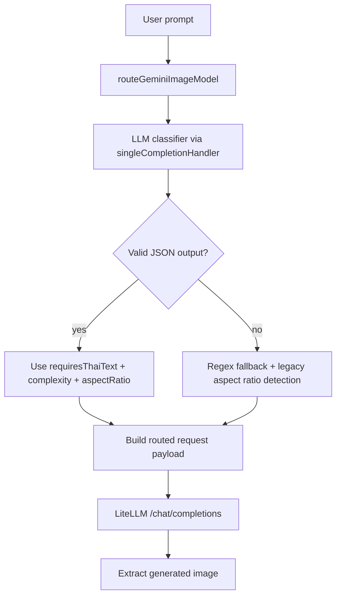

# Gemini Image Auto-Router – Smart Model Selection for LiteLLM Image Generation

**Date:** 2026-03-08

## Summary

The initial auto-router release introduced `gemini-image-auto-router` for LiteLLM image generation to balance quality and cost between Gemini image models.
v2 upgrades this flow with LLM-based classification using the current chat model.

## v2: LLM-based Classification and Routing

### 1) Model ID prefix migration

v2 standardizes routed model IDs to provider-prefixed values:

- from `gemini-2.5-flash-image` / `gemini-3.1-flash-preview`
- to `google/gemini-2.5-flash-image` / `google/gemini-3.1-flash-image-preview`

Legacy IDs are still handled for compatibility and fallback paths.

### 2) LLM-based routing (replacing regex-first heuristic)

Auto-routing now uses the current chat model (via `singleCompletionHandler()`) to classify image prompts instead of relying on regex as the primary decision layer.

Classifier flow:

1. Build a dedicated classifier prompt.
2. Send it to the current chat model.
3. Parse JSON response fields:
    - `requiresThaiText`
    - `complexity`
    - `aspectRatio`
    - `reason`
4. Route to the target Gemini image model based on classification output.

If the classifier call cannot run, routing falls back to the previous regex-based strategy.

### 3) LLM-based aspect ratio detection for auto-router

For `google/gemini-2.5-flash-image` when selected through `gemini-image-auto-router`:

- aspect ratio is now returned by the same classifier response used for routing
- this replaces the prior auto-router behavior that combined:
    - regex detection from prompt text
    - binary header parsing from input image dimensions

This allows model routing + aspect ratio selection in a single classification round-trip.

### 4) `apiConfiguration` threading

`GenerateImageTool.execute()` now forwards `task.apiConfiguration` into `generateImageWithLiteLLM()` so the router can initialize the appropriate API handler and run classifier calls using the active chat configuration.

### 5) Fallback strategy

If the current chat model path does not support classifier completion (e.g., `completePrompt` capability unavailable) or returns invalid JSON:

- fallback to regex-based routing behavior
- fallback to previous aspect ratio priority logic (`prompt explicit` → `input image` → `default`)

### 6) Test coverage expansion

Test coverage increased from **77** to **86** tests, with added scenarios for:

- LLM-based routing decisions
- fallback behavior
- LLM-provided aspect ratio handling
- `apiConfiguration` propagation into LiteLLM generation path

## v3: LLM-only Thai Text Classification + Simplified Config/Fallback

### 1) Removed regex-based Thai detection entirely

Regex-based Thai detection has been fully removed from auto-routing.
The router no longer checks Thai characters in the prompt to infer whether Thai text should appear in the output image.

`requiresThaiText` is now decided only by the LLM classifier (using the current chat model), which better represents user intent (e.g., a Thai-language prompt like "วาดรูปแมว" does not necessarily require Thai text in the image).

### 2) Removed `aspectRatio` and `personGeneration` from Gemini 3.1 image config

For `google/gemini-3.1-flash-image-preview`, `imageConfig` has been simplified:

- removed `aspectRatio`
- removed `personGeneration`
- keep only `imageSize: "1K"`

### 3) Updated fallback behavior (no regex fallback)

When the LLM classifier is unavailable or unusable, routing now always falls back directly to:

- `google/gemini-2.5-flash-image`

The system no longer attempts regex-based guessing in fallback mode.

### 4) Test count update

Total test count is now **67** tests (down from **86**) after removing regex-detection test cases.

## Changed files (v2)

- [`src/api/providers/utils/gemini-image-router.ts`](../../src/api/providers/utils/gemini-image-router.ts)
- [`src/api/providers/utils/image-generation.ts`](../../src/api/providers/utils/image-generation.ts)
- [`src/core/tools/GenerateImageTool.ts`](../../src/core/tools/GenerateImageTool.ts)
- [`packages/types/src/image-generation.ts`](../../packages/types/src/image-generation.ts)
- [`src/api/providers/utils/__tests__/gemini-image-router.spec.ts`](../../src/api/providers/utils/__tests__/gemini-image-router.spec.ts)
- [`src/api/providers/utils/__tests__/image-generation.spec.ts`](../../src/api/providers/utils/__tests__/image-generation.spec.ts)
- [`src/core/tools/__tests__/generateImageTool.test.ts`](../../src/core/tools/__tests__/generateImageTool.test.ts)

## Routing flow (v2)

