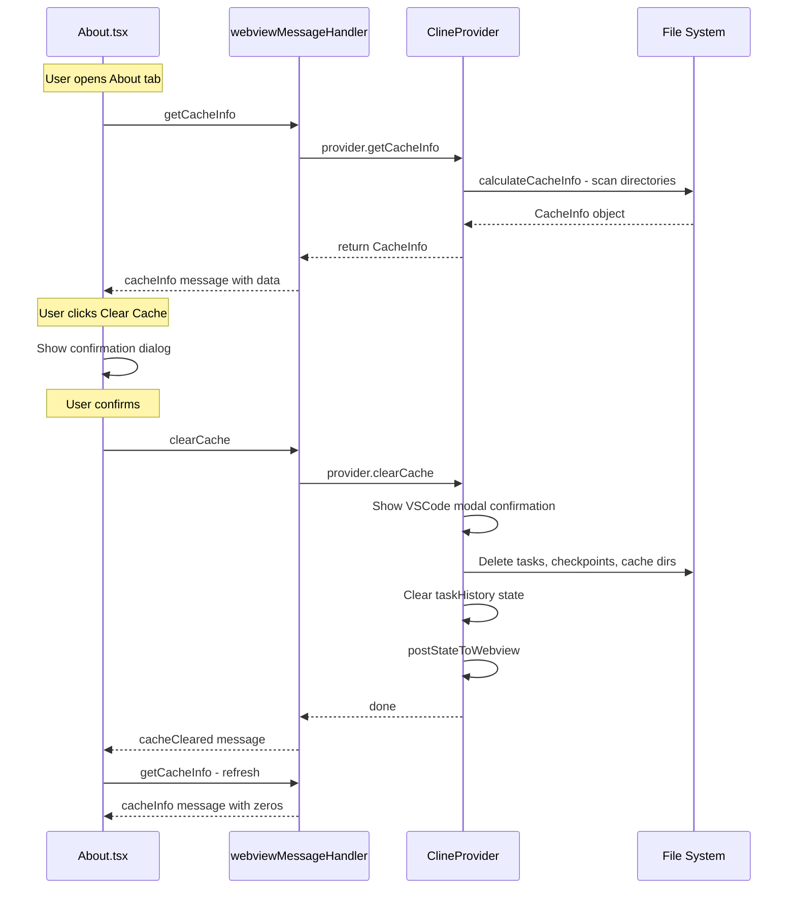

# Cache Management Feature for About Page

**Date:** 2026-05-01
**Status:** ✅ Implemented
**Author:** Architect Mode

## Overview

Add a cache management section to the "About ModelHarbor Agent" settings page that displays cache usage information (Tasks and Checkpoints), disk usage, and provides a "Clear Cache" button to free up space.

## Architecture Exploration Findings

### Current Storage Structure

```
{basePath}/
├── tasks/{taskId}/           # Task data (messages, API history, file changes)
│   └── checkpoints/          # Per-task checkpoint git repos (if enabled)
├── checkpoints/{hash}/       # Workspace-level checkpoint git repos
├── cache/                    # General cache directory
└── settings/                 # Settings files
```

- `basePath` is resolved by `getStorageBasePath()` in `src/utils/storage.ts` — supports custom storage paths via VSCode setting `customStoragePath`
- Task directory size is already calculated per-task in `src/core/task-persistence/taskMetadata.ts` using `get-folder-size` library with a `NodeCache` (30s TTL)
- Each `HistoryItem` has a `size` field (in bytes)

### Current About Page

- Component: `webview-ui/src/components/settings/About.tsx`
- Rendered in `SettingsView.tsx` at line 955: `{renderTab === "about" && <About />}`
- Currently shows: version info, contact links, debug mode toggle, manage settings buttons (export/import/reset)
- Uses `vscode.postMessage({ type: "..." })` pattern for backend communication

### Message Flow Pattern

```
UI (About.tsx)
  → vscode.postMessage({ type: "getCacheInfo" })
  → webviewMessageHandler.ts (switch/case on message.type)
  → ClineProvider method
  → provider.postMessageToWebview({ type: "cacheInfo", ... })
  → UI receives ExtensionMessage
```

### Key Files

| File                                                  | Purpose                                                  |
| ----------------------------------------------------- | -------------------------------------------------------- |
| `packages/types/src/vscode-extension-host.ts`         | `WebviewMessage` and `ExtensionMessage` type definitions |
| `src/core/webview/webviewMessageHandler.ts`           | Central message handler (switch/case)                    |
| `src/core/webview/ClineProvider.ts`                   | Main provider with storage access                        |
| `src/utils/storage.ts`                                | Storage path utilities                                   |
| `src/core/task-persistence/taskMetadata.ts`           | Task size calculation with caching                       |
| `src/services/checkpoints/ShadowCheckpointService.ts` | Checkpoint management                                    |
| `webview-ui/src/components/settings/About.tsx`        | About page UI component                                  |
| `webview-ui/src/i18n/locales/en/settings.json`        | English i18n strings                                     |
| `webview-ui/src/i18n/locales/th/settings.json`        | Thai i18n strings                                        |

---

## Design

### 1. New Types

#### ExtensionMessage Addition

In `packages/types/src/vscode-extension-host.ts`, add to `ExtensionMessage.type` union:

```typescript
| "cacheInfo"
| "cacheCleared"
```

Add new optional fields to `ExtensionMessage`:

```typescript
cacheInfo?: {
  tasksSize: number        // Total size of all task directories in bytes
  checkpointsSize: number  // Total size of checkpoint directories in bytes
  cacheSize: number        // Total size of cache directory in bytes
  totalSize: number        // Sum of all above
  taskCount: number        // Number of tasks
  diskTotal: number        // Total disk space in bytes
  diskUsed: number         // Used disk space in bytes
  diskAvailable: number    // Available disk space in bytes
}
```

#### WebviewMessage Addition

In `packages/types/src/vscode-extension-host.ts`, add to `WebviewMessage.type` union:

```typescript
| "getCacheInfo"
| "clearCache"
```

### 2. Backend: Cache Info Utility

Create new file `src/utils/cacheInfo.ts`:

```typescript
// Key functions:
export async function calculateCacheInfo(globalStoragePath: string): Promise<CacheInfo>
export async function clearAllCache(globalStoragePath: string): Promise<void>
```

**`calculateCacheInfo`** will:

1. Call `getStorageBasePath(globalStoragePath)` to resolve the base path
2. Use `get-folder-size` library (already a dependency) to calculate:
    - `{basePath}/tasks/` total size
    - `{basePath}/checkpoints/` total size (if exists)
    - `{basePath}/cache/` total size (if exists)
3. Count tasks by listing `{basePath}/tasks/` subdirectories
4. Get disk usage via `checkDiskSpace` from `check-disk-space` package (or `fs.statfs` if available on target Node.js version)
5. Return `CacheInfo` object

**`clearAllCache`** will:

1. Read all task IDs from `{basePath}/tasks/` directory
2. For each task, call `ShadowCheckpointService.deleteTask()` to clean up checkpoint git repos
3. Remove the entire `{basePath}/tasks/` directory contents
4. Remove `{basePath}/checkpoints/` directory contents
5. Remove `{basePath}/cache/` directory contents
6. NOT remove `{basePath}/settings/` — user settings should be preserved

### 3. Backend: ClineProvider Methods

Add to `src/core/webview/ClineProvider.ts`:

```typescript
async getCacheInfo(): Promise<CacheInfo> {
  const globalStoragePath = this.contextProxy.globalStorageUri.fsPath
  return calculateCacheInfo(globalStoragePath)
}

async clearCache(): Promise<void> {
  // Show confirmation dialog via vscode.window.showWarningMessage
  const answer = await vscode.window.showWarningMessage(
    t("common:confirmation.clear_cache"),
    { modal: true },
    t("common:answers.yes"),
  )
  if (answer !== t("common:answers.yes")) return

  const globalStoragePath = this.contextProxy.globalStorageUri.fsPath
  await clearAllCache(globalStoragePath)

  // Clear task history from state
  await this.updateGlobalState("taskHistory", [])
  this.recentTasksCache = undefined

  // Remove current task from stack if any
  await this.removeClineFromStack()

  await this.postStateToWebview()
}
```

### 4. Backend: Message Handler

Add to `src/core/webview/webviewMessageHandler.ts` switch/case:

```typescript
case "getCacheInfo": {
  const cacheInfo = await provider.getCacheInfo()
  await provider.postMessageToWebview({ type: "cacheInfo", cacheInfo })
  break
}
case "clearCache": {
  await provider.clearCache()
  await provider.postMessageToWebview({ type: "cacheCleared" })
  break
}
```

### 5. Frontend: About Component Changes

Modify `webview-ui/src/components/settings/About.tsx` to add a new "Cache Management" section:

```
┌─────────────────────────────────────────────┐
│ Cache Management                             │
├─────────────────────────────────────────────┤
│                                              │
│  Tasks:       1.2 GB  (42 tasks)            │
│  Checkpoints: 800 MB                        │
│  Cache:       50 MB                         │
│  ─────────────────────────                  │
│  Total:       2.05 GB                       │
│                                              │
│  Disk Usage:  125 GB / 500 GB (25%)         │
│  [████████░░░░░░░░░░░░░░░░░░░]              │
│                                              │
│  [ 🗑️ Clear All Cache ]                     │
│                                              │
└─────────────────────────────────────────────┘
```

**Component behavior:**

- On mount (when About tab becomes visible), send `getCacheInfo` message
- Show loading spinner while waiting for response
- Display formatted sizes using a helper function (e.g., `formatBytes(bytes)`)
- Show disk usage as a progress bar
- "Clear Cache" button shows confirmation dialog before sending `clearCache` message
- After `cacheCleared` response, re-fetch cache info to show updated sizes

**State management:**

- Use local `useState` for cache info (not part of `ExtensionState` since it's computed on-demand)
- Use `useEffect` to listen for `cacheInfo` and `cacheCleared` messages via `window.addEventListener("message", ...)`

### 6. i18n Keys

Add to `webview-ui/src/i18n/locales/en/settings.json` under `about`:

```json
{
	"about": {
		"cacheManagement": "Cache Management",
		"cache.tasks": "Tasks",
		"cache.checkpoints": "Checkpoints",
		"cache.cache": "Cache",
		"cache.total": "Total",
		"cache.diskUsage": "Disk Usage",
		"cache.taskCount": "{{count}} tasks",
		"cache.clearButton": "Clear All Cache",
		"cache.clearing": "Clearing cache...",
		"cache.loading": "Calculating cache size...",
		"cache.clearConfirm.title": "Clear All Cache?",
		"cache.clearConfirm.description": "This will permanently delete all task history, checkpoints, and cached data. This action cannot be undone.",
		"cache.clearConfirm.cancel": "Cancel",
		"cache.clearConfirm.confirm": "Clear Cache"
	}
}
```

### 7. Message Flow Diagram



---

## Files to Modify

### New Files

| File                                    | Description                                   |
| --------------------------------------- | --------------------------------------------- |
| `src/utils/cacheInfo.ts`                | Cache size calculation and clearing utilities |
| `src/utils/__tests__/cacheInfo.test.ts` | Tests for cache info utilities                |

### Modified Files

| File                                                          | Changes                                                                                                                                      |
| ------------------------------------------------------------- | -------------------------------------------------------------------------------------------------------------------------------------------- |
| `packages/types/src/vscode-extension-host.ts`                 | Add `cacheInfo`, `cacheCleared` to `ExtensionMessage.type`; add `cacheInfo` field; add `getCacheInfo`, `clearCache` to `WebviewMessage.type` |
| `src/core/webview/ClineProvider.ts`                           | Add `getCacheInfo()` and `clearCache()` methods                                                                                              |
| `src/core/webview/webviewMessageHandler.ts`                   | Add `getCacheInfo` and `clearCache` cases                                                                                                    |
| `webview-ui/src/components/settings/About.tsx`                | Add cache management UI section                                                                                                              |
| `webview-ui/src/components/settings/__tests__/About.spec.tsx` | Add tests for cache management UI                                                                                                            |
| `webview-ui/src/i18n/locales/en/settings.json`                | Add cache management i18n keys                                                                                                               |
| `webview-ui/src/i18n/locales/th/settings.json`                | Add Thai translations for cache management                                                                                                   |
| `src/i18n/locales/en/common.json`                             | Add confirmation dialog keys                                                                                                                 |
| `src/i18n/locales/th/common.json`                             | Add Thai confirmation dialog keys                                                                                                            |

### Dependencies to Add

| Package            | Purpose                                                                                           |
| ------------------ | ------------------------------------------------------------------------------------------------- |
| `check-disk-space` | Cross-platform disk space checking (or use Node.js built-in `fs.statfs` if targeting Node 18.15+) |

---

## Implementation Considerations

1. **Performance**: Cache size calculation can be slow for large task histories. Consider:

    - Running size calculation asynchronously with a loading state
    - Caching the result with a TTL (similar to `taskSizeCache` in `taskMetadata.ts`)
    - Using `get-folder-size` library which is already a dependency

2. **Safety**: The "Clear Cache" action is destructive:

    - Must show a modal confirmation dialog (both in webview AND via `vscode.window.showWarningMessage`)
    - Should NOT delete settings
    - Should NOT delete the current active task

3. **Active Task Protection**: Before clearing cache, check if there's an active task in the stack and warn the user or skip it.

4. **Custom Storage Path**: Must use `getStorageBasePath()` to respect user-configured custom storage paths.

5. **Cross-platform Disk Space**: Use `check-disk-space` package or `fs.statfs` (Node 18.15+) for disk usage info. The `statfs` approach is preferred if minimum Node version supports it, as it avoids an extra dependency.

6. **Size Formatting**: Create a shared utility `formatBytes(bytes)` that formats bytes into human-readable strings (KB, MB, GB) for the UI.

7. **Progress Bar for Disk Usage**: Use a simple CSS-based progress bar with Tailwind classes, styled with VSCode CSS variables for theme consistency.

---

## Implementation Summary

**Date Completed:** 2026-05-01
**Status:** All backend and UI features implemented and tested

### What Was Implemented

All items from the design were implemented with the following notable details:

#### Backend

| File                                          | Description                                                                                                                                                                                                                                                                                                                                    |
| --------------------------------------------- | ---------------------------------------------------------------------------------------------------------------------------------------------------------------------------------------------------------------------------------------------------------------------------------------------------------------------------------------------- |
| `src/utils/cacheInfo.ts`                      | New utility with `calculateCacheInfo(basePath)`, `clearAllCache(basePath)`, and `formatBytes(bytes)`. Uses `get-folder-size` for directory sizes and `fs.statfs` for disk space (no extra dependency needed).                                                                                                                                  |
| `packages/types/src/vscode-extension-host.ts` | Added standalone `CacheInfo` interface with fields: `tasksSize`, `tasksCount`, `checkpointsSize`, `checkpointsCount`, `cacheSize`, `totalSize`, `diskTotal`, `diskUsed`, `diskAvailable`. Added `"cacheInfo"` and `"cacheCleared"` to `ExtensionMessage` type union. Added `"getCacheInfo"` and `"clearCache"` to `WebviewMessage` type union. |
| `src/core/webview/ClineProvider.ts`           | Added `getCacheInfo()` method that calculates cache info and posts to webview. Added `clearCache()` method that shows VSCode confirmation dialog, clears cache, and refreshes info.                                                                                                                                                            |
| `src/core/webview/webviewMessageHandler.ts`   | Added `"getCacheInfo"` and `"clearCache"` message handlers.                                                                                                                                                                                                                                                                                    |
| `src/i18n/locales/en/common.json`             | Added confirmation and error i18n keys for cache clearing.                                                                                                                                                                                                                                                                                     |
| `src/i18n/locales/th/common.json`             | Added Thai translations for confirmation and error keys.                                                                                                                                                                                                                                                                                       |

#### UI

| File                                               | Description                                                                                                                                                                                                                                                         |
| -------------------------------------------------- | ------------------------------------------------------------------------------------------------------------------------------------------------------------------------------------------------------------------------------------------------------------------- |
| `webview-ui/src/context/ExtensionStateContext.tsx` | Added `cacheInfo` state and message handlers for `"cacheInfo"` and `"cacheCleared"` messages.                                                                                                                                                                       |
| `webview-ui/src/components/settings/About.tsx`     | Added Cache Management section with: total cache size display with breakdown (Tasks, Checkpoints, Cache), disk usage progress bar with color coding (green <70%, yellow 70–90%, red >90%), Clear Cache button with confirmation, Refresh button, and loading state. |
| `webview-ui/src/i18n/locales/en/settings.json`     | Added 13 translation keys for cache management UI.                                                                                                                                                                                                                  |
| `webview-ui/src/i18n/locales/th/settings.json`     | Added Thai translations for all 13 cache management keys.                                                                                                                                                                                                           |

#### Tests

| File                                                          | Description                                                                                                                                 |
| ------------------------------------------------------------- | ------------------------------------------------------------------------------------------------------------------------------------------- |
| `src/utils/__tests__/cacheInfo.test.ts`                       | 21 tests covering `formatBytes`, `calculateCacheInfo`, and `clearAllCache` — **all passing**.                                               |
| `webview-ui/src/components/settings/__tests__/About.spec.tsx` | 14 tests written for cache management UI — blocked by pre-existing React dual-instance issue in the project (not specific to this feature). |

### Deviations from Original Design

1. **`CacheInfo` as a standalone interface**: The design showed `cacheInfo` as an inline optional field on `ExtensionMessage`. The implementation extracted it into a standalone `CacheInfo` interface for better type reuse.

2. **Field naming**: The design used `taskCount` (singular); the implementation uses `tasksCount` and `checkpointsCount` (plural) for consistency with the corresponding `tasksSize` and `checkpointsSize` fields.

3. **No `check-disk-space` dependency**: The design proposed adding the `check-disk-space` package. The implementation used Node.js built-in `fs.statfs` instead, avoiding an extra dependency entirely.

4. **Disk usage progress bar color coding**: The design specified a simple progress bar. The implementation added automatic color coding based on usage percentage (green <70%, yellow 70–90%, red >90%) for better UX.

5. **State management via ExtensionStateContext**: The design suggested using local `useState` with `window.addEventListener("message", ...)`. The implementation integrated `cacheInfo` into `ExtensionStateContext.tsx` for consistency with the existing state management pattern in the codebase.

6. **`clearAllCache` implementation**: The design proposed calling `ShadowCheckpointService.deleteTask()` per task. The implementation directly removes directory contents for tasks, checkpoints, and cache — a simpler approach that avoids per-task service overhead.

7. **Refresh button**: The implementation added an explicit Refresh button (not in the original design) to allow users to re-calculate cache size on demand.
